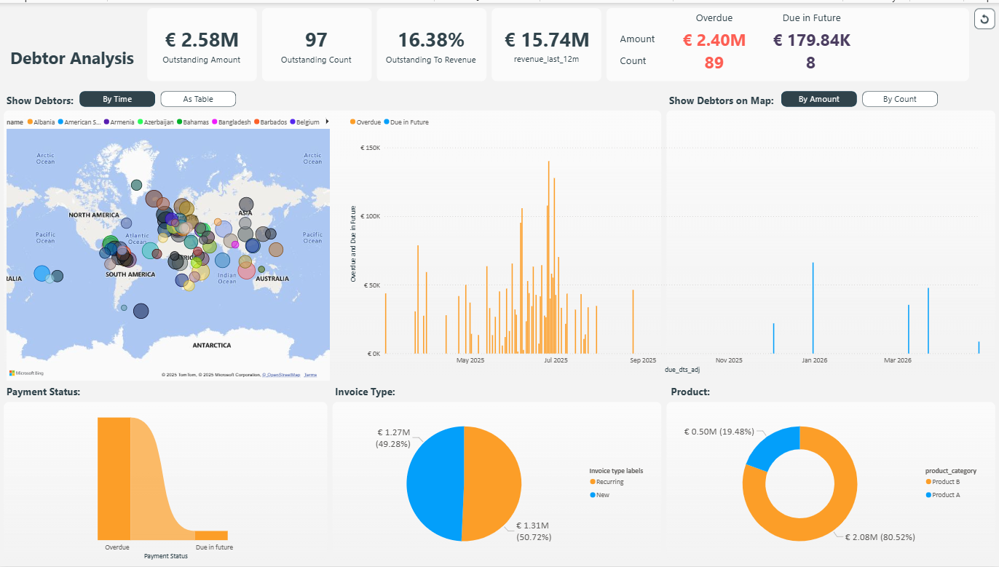

# CashFlow-Compass-Global-Accounts-Receivable-Intelligence-Dashboard
The CashFlow Compass dashboard tracks €2.58M in outstanding debts (16.38% of revenue) with geographic visualization of global debtors, timeline analysis of due dates, and segmentation by payment status, invoice type, and product category, enabling targeted collection strategies and improved cash flow management.

# CashFlow Compass: Global Accounts Receivable Intelligence Platform

## Executive Summary
CashFlow Compass is a comprehensive accounts receivable analytics solution that provides real-time visibility into outstanding debts, payment timelines, and debtor geographic distribution. This powerful dashboard enables finance teams to optimize collections strategies, prioritize follow-ups, and improve cash flow management across global operations.

## Key Performance Indicators

### Financial Overview
- **Outstanding Amount:** €2.58M
- **Outstanding Count:** 97 accounts
- **Outstanding to Revenue Ratio:** 16.38%
- **Revenue (Last 12 Months):** €15.74M

### Payment Status
- **Overdue:** €2.40M across 89 accounts
- **Due in Future:** €179.84K across 8 accounts

## Dashboard Features

### Geographic Visualization
- Interactive world map displaying debtor distribution by country
- Color-coded markers for easy identification of regions
- Toggle view between amount-based and count-based visualization

### Temporal Analysis
- Timeline visualization of payment due dates
- Historical view of overdue and upcoming payments
- Differentiated display of overdue (orange) and future (blue) payments

### Segmentation Analytics
- **Payment Status:** Visual breakdown of overdue vs. future payments
- **Invoice Type:** Distribution between recurring (€1.31M, 50.72%) and new invoices (€1.27M, 49.28%)
- **Product Category:** Revenue breakdown by product line with Product B (€2.08M, 80.52%) and Product A (€0.50M, 19.48%)

## Business Benefits
1. **Improved Cash Flow Management:** Prioritize collection efforts based on amount, timing, and location
2. **Geographic Intelligence:** Identify regional payment trends and adjust credit policies accordingly
3. **Risk Mitigation:** Early identification of potential payment defaults
4. **Resource Optimization:** Focus collection teams on high-value overdue accounts
5. **Strategic Decision Support:** Data-driven insights for credit policy and customer relationship management

## Implementation
The dashboard is built on modern business intelligence infrastructure, providing:
- Real-time data synchronization with accounting systems
- Interactive filtering capabilities
- Customizable views based on user roles
- Exportable reports for stakeholder communication

## Intended Users
- Finance Directors
- Accounts Receivable Teams
- Credit Controllers
- CFOs and Financial Analysts
- Sales and Account Management Teams

## Getting Started
Access the dashboard through your company portal and use the filter controls to customize your view:
- Filter by time period
- Toggle between map visualizations
- Select specific countries or regions
- Export data for further analysis

---

*For technical support or implementation questions, please contact the finance systems team.*
